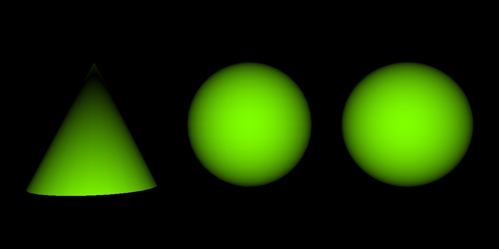

# Practical Assignment 4
**Dealine**: 12.11.2020

Please put your name here:  
**Name:** .......
## Problem 1
### Sphere Solid (Points 25)
In this assignment we will continue working with _compound obkects_: solids. 
1. Fork the current repository.
2. Modify the README.md file in your fork and put your name above.
3. Have a look at the new classes ```CSolidQuad``` and ```CSolidCone```. Study how a quadrilateral and a cone may be constructed from triangles.
4. Implement the ```CSolidSphere``` class  in the same way as ```CSolidCone``` class is implemented. Please provide your code with comments.

**Hint 1:** Make use of [spherical coordinates](https://en.wikipedia.org/wiki/Spherical_coordinate_system).

**Hint 2:** Sphere will consist of two "caps": top and bottom, consisting out of triangles, and the "sides", consisting out of quadrilaterals. Additional insights may be found in [```rt::CSolidCylinder``` constructor](https://github.com/Project-10/OpenRT/blob/master/modules/core/SolidCylinder.cpp). You might need to use _height segments_ for the sphere as well. Please use the number of height segments equal to the half of the number of sphere's sides.

If your implementation works as expected you should see an image of 3 geometrical objects:


## Problem 2 
### Vertex Normals (Points 25)
Rather then storing a single _geometry normal_ for a triangle, it is often useful to store at each ```vertex``` a corresponding _vertex normal_. The advantage is that if we have a hit point on a triangle, the shading normal can be smoothly interpolated between the vertex normals. If neighboring triangles share the same vertex normals, a smooth appearance can be generated over non-smooth tesselated geometry.  
Proceed as follows:
1. Your ray class is extended with two additional ```float``` values calles ```Ray::u``` and ```Ray::v```.
2. In ```bool CPrimTriangle::intersect(Ray& ray) const```, store the computed barycentric coordinates into ```Ray::u``` and ```Ray::v```.  
   > Note: as long as your other classes (_e.g._ ```CPrimSphere```) don’t need local surface coordinates, there is no need to compute them yet.
3. Class ```CPrimTriangle``` now stores the vertex normals (```m_na```, ```m_nb``` and ```m_nc```) additionaly to the original vertex positions. 
   > Note: that all the vertex normals are optionals. Please pay extra attantion to how they initialized in the constructor.
4. In ```Vec3f CPrimTriangleSmooth::getNormal(const Ray& ray) const``` check whether the vertex normals are initialized and if yes, use the _u_/_v_ coordinates of the hitpoint to interpolate between the vertex normals and return interpolated normal.
   > Note: interpolating normalized vectors will not return a normalized vector! Make sure to normalize your interpolated normal!
5. Extend the code in ```CSolidCone``` constructor in such a way that the triangles will be created with the additional normals. Calculate these normals and pass them within the triangles' constructors. What normal will be chosen for the _top_ vertex? Please explain in comments.
   > Note: if you stuck here, you may refere to OpenRT library: [```rt::CSolidCone```](https://github.com/Project-10/OpenRT/blob/master/modules/core/SolidCone.cpp)
6. Extend your code in ```CSolidSphere``` constructor in such a way that the triangles will be created with the additional normals. Calculate these normals (_e.g._ using the spherical coordinate system) and pass them within the triangles' and quads' constructors.
7. Test your implementation the scene from Problem 1. Compare the difference between the Solid and Primitive spheres. Explain below why smoothed cone looks strange. How would you fix it?

**Explanation:** ...

If everything is correct your images should look like this:  



## Problem 3
### Texturing Primitives (Points 25)
Until now we have only used one color per object. Nevertheless, in reality, _e.g._ in games, objects are very often colorful because of the usage of textures. This is also a way of making a surface look more geometrically complex. Usually, textures are used by storing _texture coordinates_ at the vertices of each triangles, and interpolating those to find the correct texel that has to be used for a surface point.
1. Study new class ```CTexture``` added to the framework.
2. Classes ```CShaderFlat``` and ```CShaderEyelight``` now have additional constructors, which take a texture instead of a color as a parameter.
3. Class ```CPrimTriangle``` now contains additional variables ```m_ta```, ```m_tb``` and ```m_tc```, which correspond to the texture coordinates at vertex ```a```, ```b```, and ```c```, respectively. Here we use ```Vec2f```’s to store the texture coordinates (not ```Vec3f```), because they require only 2 coordinates (barycentric coordinates). 
4. Class ```IPrim``` now has additional virtual method ```virtual Vec2f getTextureCoords(const Ray& ray) const = 0;``` which should be implemented in all derived classes. 
5. Implement method ```Vec2f CPrimSphere::getTextureCoords(const Ray& ray) const``` using spherical coordinates and lecture notes. The method should to return the _x_ and _y_ coordinates of the interpolated vertex texture coordinates.
   > Note: if you stuck here, you may refere to OpenRT library: [```rt::CPrimSphere```](https://github.com/Project-10/OpenRT/blob/master/modules/core/PrimSphere.cpp), however it may contain a bug. Double check with lecture notes and comment the code!
6. Implement method ```Vec3f CShaderFlat::shade(const Ray& ray) const ``` to use the texture coordinates returned by ```getTextureCoords()``` if texture exists.
7. Test your implementation with the texture of the earth by replacing ```pShaderGreen``` with ```pShaderEarth``` in main.cpp for primitive sphere.

If everything is correct your images should look like this:  


## Problem 4
### Texturing Solids (Points 25)

## Bonus
### Texturing (Points 20)
2. Implemet the method ```Vec2f CPrimTriangleSmoothTextured::getUV(const Ray& ray) const``` which is now a virtual method in your primitive base class. In ```CPrimTriangleSmoothTextured```, implement this function to return the _x_ and _y_ coordinates of the interpolated vertex texture coordinates. (For other primitives, just ignore it for now, we’ll only use texture-shaders with triangles for now).
3. Implement the ```CShaderEyelightTextured::Shade()``` method to use the texture coordinates returned by ```getUV()``` and combine the texel color with the calculated eyelight color using the vector product. 

Test your implementation on barney.obj with barney.bmp. If everything is correct your image should look like this:


## Submission
Please submit the assignment by making a pull request.
**Important** : Please make sure that
- No _extra files_ are submitted (except those, which were mentioned in the assignment)
- The changes were made _only_ in those files where you were asked to write your code
- The Continiouse Integration system (appVeyor) can build the submitted code
- The rendered images are also submitted in the folder "renders" 
